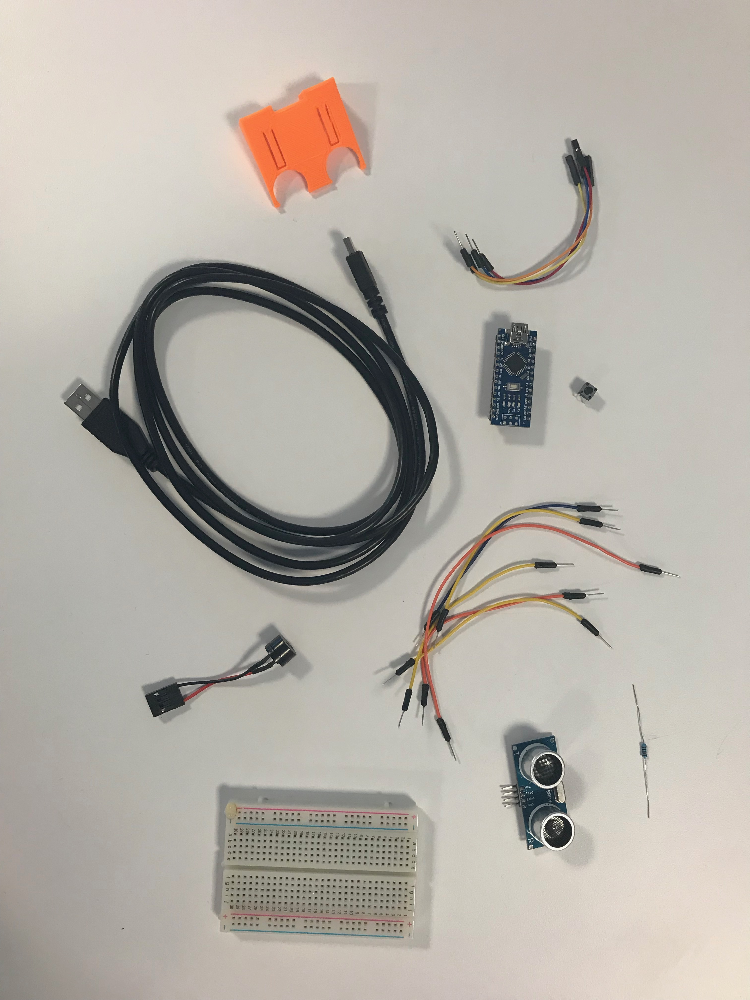
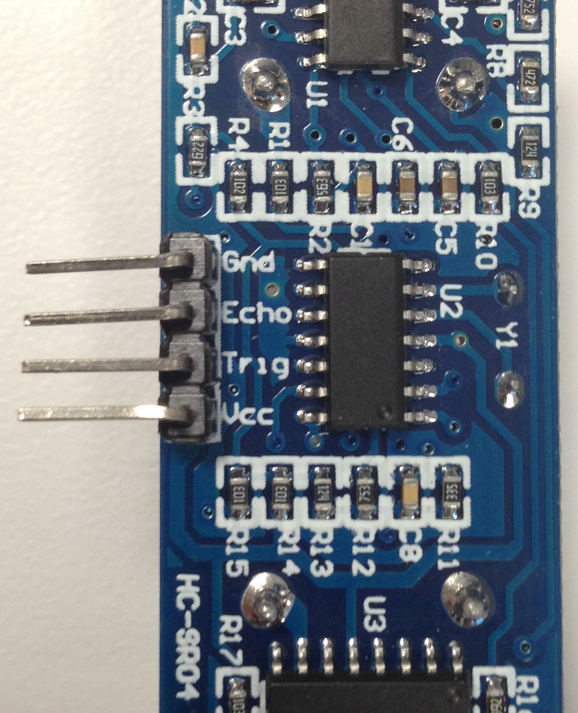
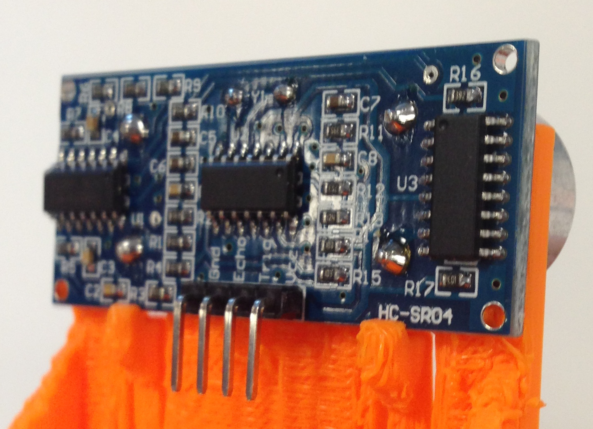
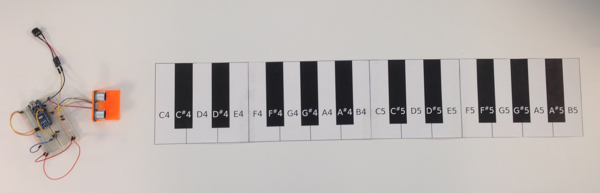

# Table of Contents

1. [Hardware](1-Hardware.md)
2. [Software](2-Software.md)
3. [Operate](3-Operate.md)

---

# Hardware
Familiarize yourself with the materials. You should have the following:
- 1x Arduino Nano
- 1x HC-SR04 Ultrasonic Sensor
- 1x HC-SR04 Plastic Mount
- 1x Piezobuzzer
- 1x Pushbutton
- 1x 10kOhm Resistor
- 1x Breadboard
- 1x USB Type A Male-to-USB Mini B Male Cable
- 1x Keyboard Printout
- 4x male-to-female jumper wires
- Various male-to-male jumper wires

## The Schematic
As a reference, here is the schematic for this project:

Joints where there is a solid black dot indicate a connection - otherwise, wires just cross over for the sake of depiction.

The schematic can be broken up into four sections:
- Arduino Nano
- Piezobuzzer (or speaker)
- Ultrasonic sensor
- Pushbutton

#### Arduino Nano
The Arduino Nano is our "brain" for this circuit. The [Arduino](https://www.arduino.cc/) boards are open-source hardware based on the AVR Atmel microcontrollers. The Nano family is one of the smaller (physically and spec-wise) boards that will work for our needs.

### Piezobuzzer
The piezobuzzer is our speaker, and all it needs is a power connection. A piezobuzzer emits sounds from a material that fluctuates in response to electricity.

### Ultrasonic Sensor
The HC-S04 only has 4 connectors. You can see on the board itself what the pins are.

Two pins (`Vcc` and `Gnd`) are power-related, and the center two pins, called `Echo` and `Trig` for used for signalling to the microcontroller. The [HC-SR04 manual](https://www.mouser.com/ds/2/813/HCSR04-1022824.pdf) contains more information about the specifics of the `Echo` and `Trig` pins and how they work.

### Pushbutton
A pushbutton circuit is implemented to demonstrate some "lower level" electronics. Normally, pushbuttons are used to represent "pressed = on, depressed = off". In this project, the pushbutton is configured as a toggle switch (push to turn on, push again to turn off), so the implementation details are open for studying or reference.

## Assembly
Putting everything together first involves some set up.

### Mount the HC-SR04
You should have a 3D printed mount for your ultrasonic sensor. Set the sensor into the mount so that it looks like the following:

Notice the two "tabs" on the mount that hold the board in place so it sits a bit more flush against the plastic. Having the sensor close to level is important, as it affects how the overall project works.

It might help to set the sensor in the mount, but not press it all the way in first. With two hands, press on the two tabs with your thumbs so they bend enough for the sensor to clear them, and try to simulataneously "pull" the sensor down with your other fingers.

Or however you get it to mount is fine.

### The Breadboard
A [breadboard](https://en.wikipedia.org/wiki/Breadboard) is used for electronics prototyping projects. Sparkfun has [great breadboard guide](https://learn.sparkfun.com/tutorials/how-to-use-a-breadboard/all), if you want to learn more. The board is design in such a way that the "terminal strips" are all connected horizontally (except where the DIP support channel breaks it in two) and the "power rails" are all connected vertically. Here's a quick image from the Sparkfun guide above to demonstrate how that works in breadboards.

### Build the Circuit
For reference, here is an image of the circuit:

Start with the components that go into the board, then connect all the wires as seen in the circuit image using jump wires. Some notes before you begin:
- You don't need to replicate the circuit image _exactly_
  - As long as you make the right connections, you can build the circuit however you want
- The Arduino can be a little hard to remove without potentially bending some pins
  - Try to make sure you have the Nano aligned properly before you press it into the breadboard
- The pushbutton leads might be a little short, so don't be afraid to press that in harder

1. Connect the Arduino to the breadboard
2. Connect the pushbutton to the breadboard (take note of the alignment of the pushbutton)
3. Connect the 10kOhm resistor
4. Connect the piezobuzzer by using a male-to-male jump wire and plugging one end into the breadboard and the other end into the piezobuzzer connector
5. Thread the 4 male-to-female jump wires through the gap in the ultrasensor mount female ends up, then connect the female headers to the pins of the HC-SR04
> _Note: Make sure you have the proper pin connections to `Vcc` and `Gnd` when you plug the sensor into the breadboard. Reversing these can potentially damage the sensor_
6. Complete the connections to the breadboard with your jump wires

### Put The Keyboard Together
Cut out the pieces for your keyboard and tape them together. You should end up with two "octaves", starting with C4, going all the way through to B5. Refer to the [SVG](https://github.com/nathanfu88/UltrasonicKeyboard/raw/master/keyboard.svg) of the full keyboard to see what it should look like.

# Hardware Complete!
Congrats! You're done with the hardware part of it. You should have something that _kind of_ looks like the following.

Move on to the [Software](2-Software.md).